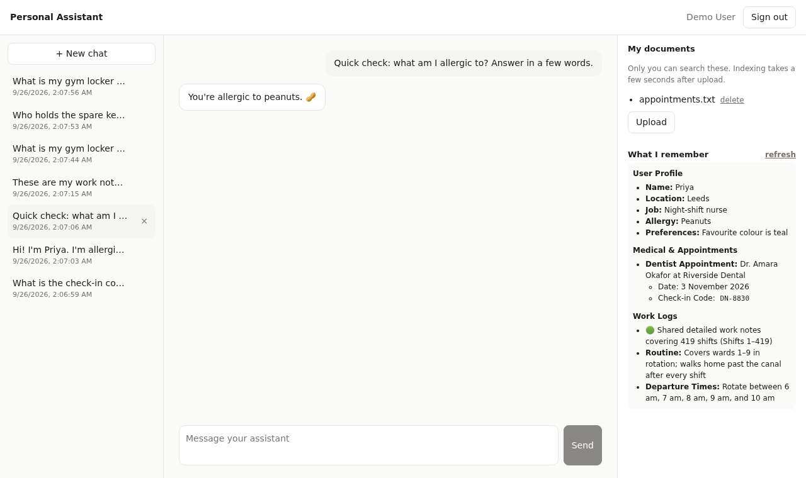

# Personal assistant

A small but real assistant app on LibraOS. People sign in with their LibraOS
account and get:

- **Chat** with the app's own agent. Replies stream in as they're written.
- **Past conversations**, listed and resumable.
- **My documents.** Upload files; the assistant answers from them, and only
  their owner can search them. Delete one and the assistant stops answering
  from it.
- **Long-term memory.** Tell it something once, and it still knows it in a new
  conversation.


A new conversation still knows what you told it in an earlier one:



```
personal-assistant/
├── libraos-app/          the LibraOS side: an app with one agent
│   ├── nova-app.yaml
│   └── agents/assistant.md
├── scripts/setup.sh      installs the app, creates a demo user
└── web/                  the browser app (Vite + React + TypeScript)
```

There is no backend of our own. The browser signs the user in and calls the
kernel with *their* token, so every answer is scoped to them by the kernel:
their conversations, their documents, their memory. All of it runs as a
normal user, not an admin.

## Quickstart

1. Start the kernel (v0.1.21 or newer) from
   [`get-started/`](../../get-started/README.md). Its
   `docker-compose.yml` already mounts `libraos-app/` into the kernel and
   switches on memory and document indexing. In `get-started/.env`, set
   `PA_DEMO_PASSWORD` (12+ characters) and check that `LIBRA_OS_OIDC_CLIENTS`
   includes `personal-assistant=http://localhost:5180/callback`.

   ```bash
   cd get-started && docker compose up -d
   ```

2. Install the app and create the demo user (safe to re-run):

   ```bash
   apps/personal-assistant/scripts/setup.sh
   # app: personal-assistant 0.1.0, 1 agent(s)
   # user: created demo@example.com
   ```

3. Run the web app:

   ```bash
   cd apps/personal-assistant/web
   npm install
   npm run dev          # http://localhost:5180
   ```

   Sign in as `demo@example.com` with your `PA_DEMO_PASSWORD`.

Try this: tell it something about yourself, then upload a file (`.txt`, `.md`,
`.pdf` or `.docx`) and ask about it in a **New chat**. Start a third chat and
ask what it knows about you. Then **delete** the file and ask again in a new
chat.

## How it works

### The agent (`libraos-app/`)

An *app* is a folder the kernel installs: [`nova-app.yaml`](libraos-app/nova-app.yaml)
names it and points at its agents, and each `agents/<id>.md` is one agent. The
frontmatter configures it and the body is its system prompt.
[`assistant.md`](libraos-app/agents/assistant.md) is a persona with
`knowledge_bindings: ["*"]`: "search every collection *the caller* may read".
For a normal user that's only their own uploads.

The kernel scans `$LIBRA_OS_APPS_ROOT` (default `/var/nova-os/apps`) at boot;
`POST /v1/apps/personal-assistant/install` (admin) registers or reloads it
without a restart. That's what `setup.sh` calls, so after editing
`assistant.md`, re-run `setup.sh`.

### Sign-in (`web/src/auth.ts`)

OIDC Authorization Code + PKCE, as explained step by step in
[`get-started/02-sign-in-with-libraos`](../../get-started/02-sign-in-with-libraos/README.md).
On top of that, this app asks for `offline_access` to get a refresh token, and
`authFetch()` refreshes once on a 401. Refresh tokens rotate (each works once),
so concurrent 401s share one refresh. The Vite dev server proxies `/oauth`, `/v1`
and `/api` to the kernel, so the app and the kernel share an origin, as they
would behind one reverse proxy in production.

### Every kernel call (`web/src/api.ts`)

| Feature | Call |
|---|---|
| Who am I | `GET /oauth/userinfo` |
| Chat | `POST /v1/apps/personal-assistant/agents/assistant/chat` with `{messages, conversation_id, stream: true}`; the reply comes back as server-sent events |
| Conversation list | `GET /v1/conversations?agent=assistant` |
| Resume | `GET /v1/conversations/:id` for the messages, then keep chatting with that `conversation_id` |
| Title / delete | `PATCH /v1/conversations/:id {title}` / `DELETE /v1/conversations/:id` |
| Upload | `POST /api/documents/upload/my-documents`, multipart field `file` |
| List documents | `GET /api/documents/tree/my-documents` |
| Delete a document | `DELETE /api/documents/rm/my-documents/<name>` |
| Memory | `GET /v1/managed/memory?agent_id=assistant` |

Things worth knowing:

- **Send the whole conversation every turn.** The chat route does not replay
  history. `conversation_id` only says where to save the turn. On resume, the
  app loads the stored messages and sends them all with the next question
  ([`Chat.tsx`](web/src/Chat.tsx)).
- **Replies stream.** With `"stream": true` the kernel answers with
  server-sent events, one JSON object per `data:` line, told apart by `type`:
  `text` frames carry the next piece of the reply, one `content` frame repeats
  the whole reply at the end, and `done` carries `conversation_id` and
  `cited_sources`. A failed turn sends `{"type":"error","error":"…"}` before
  `done`. [`api.ts`](web/src/api.ts) reads them with `fetch` and a stream
  reader (not `EventSource`, which can't `POST` or send a bearer token), and
  the chat pane renders the Markdown as it grows. Streamed turns are saved and
  remembered like any other.
- **New conversations are untitled.** The app names each one after its first
  question with a `PATCH`.
- **Uploads are private by construction.** For a normal user the kernel stores
  the file under their own folder and indexes it into a collection named
  `user_<their id>`, whatever the request says. Another user asking the same
  question gets "I don't have that information".
- **Memory is automatic.** With `LIBRA_OS_OBSERVATIONAL_MEMORY=1` the kernel
  records each turn per (user, agent) and gives it back to the agent in every
  later conversation. After roughly 8,000 tokens it condenses them into notes,
  which is what the **What I remember** panel shows. Before then the panel is
  empty, but recall already works.
- **Deleting a document removes its indexed text too**, so a new conversation
  can no longer answer from it. Use `/api/documents/rm/…`: the kernel also has
  `DELETE /api/documents/file/…`, which removes the file but leaves its indexed
  text searchable. Deleting a file doesn't touch memory, though. If you asked
  about it in a chat, the assistant may still recall that answer (see below).
- **Document search is keyword (lexical) search** on this setup: the stock
  compose has no vector database, so the kernel falls back to Postgres full-text
  search. Answers report `"grounding": "degraded_retrieval"`. Ask with words that
  appear in the document.

## Not yet

Left out on purpose, because today's kernel (v0.1.21) can't do them, or can't
do them for a normal user:

- **Personal Gmail or calendar.** Connectors are organization-wide, set up by
  an admin; there is no per-user mailbox or calendar a normal user can connect.
- **Acting for you, with your approval.** Actions with side effects go through
  the kernel's approval queue, and only admins can approve. A user can't
  approve their own assistant's action, so this assistant only talks.
- **Scheduled tasks or a daily briefing.** The kernel has no scheduler.
- **Seeing or deleting your memory item by item.** The panel shows the
  condensed notes; there's no user-facing delete. That includes what you
  learned from a document you have since deleted: memory keeps the
  conversations, not the files, so an answer the assistant gave you before the
  delete can come back from memory afterwards (with no **From:** line, because
  no document was searched).

## Gotchas we hit

- **`agents: agents` in `nova-app.yaml` is required.** Leave it out and install
  still reports `"status":"active"`, but with `"agents_registered":0`, and chat
  returns `404 agent not found: assistant`. `setup.sh` prints the agent count so
  you notice. `schema_prefix` is required even with no migrations.
- **App agent ids are not namespaced outside the chat URL.** Conversations
  (`agent_id`) and memory (`agent_id=`) know this agent as plain `assistant`,
  not `personal-assistant/assistant`, so another agent called `assistant` on the
  same kernel would show up in the same places. Pick distinctive ids.
- **A just-created conversation can 404 for a moment.** On an earlier kernel
  we saw `PATCH /v1/conversations/:id` return 404 when sent straight after a
  streamed reply, and succeed a moment later. `renameConversation()` retries
  briefly.
- **Two document deletes, one of them half a delete.** `DELETE
  /api/documents/file/…` removes the file but not its indexed text, so the
  assistant keeps answering from a file the list no longer shows.
  `DELETE /api/documents/rm/…` removes both; the app uses that.
- **Ignore the `content` frame's text if you've kept the `text` frames.** It
  repeats the whole reply, so appending it too doubles the answer. The app
  treats it as the final text and replaces what it built up.
- **Retrieved documents carry their storage path.** The kernel hands each
  retrieved chunk to the model labelled `Source: users/<id>/my-documents/…`, and
  models like to repeat it. [`assistant.md`](libraos-app/agents/assistant.md)
  shows the model the exact citation form it wants, and
  [`Markdown.tsx`](web/src/Markdown.tsx) trims any storage path that slips
  through to its file name.
- **Mount a volume for documents.** Uploaded files live in the container at
  `/app/data/nova-os/documents`. Without the `documents` volume, recreating the
  container deletes the files, but their indexed text stays in Postgres, so the
  assistant answers from files the list no longer shows.
- **Auto-indexing is off by default.** Without `LIBRA_OS_SUPERNOVA_ENABLED=true`
  uploads are stored but never searchable; the boot log says so at ERROR level
  (`capability not active … supernova_autoindex`).
- **The demo user is created by invitation.** `POST /api/admin/users/invite`
  (admin) returns an accept link, and `setup.sh` posts the password to it, as
  the invitee would, so the user's password is one they chose.
- **Port 5180, not Vite's default.** The port is part of the registered
  `redirect_uri`, so the app pins it with `strictPort`. Vite's own defaults
  (5173 and up) collide with other dev servers.
